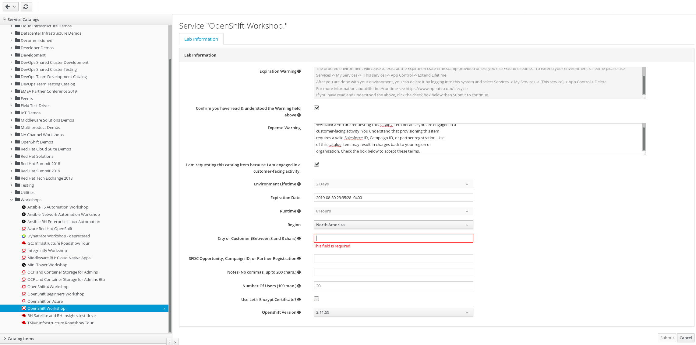

# Virtual Workshops Installation Guide

## How to Install the Workshop Content

This page describes the installation of the Virtual Workshops Content from the latest tagged release on GitHub.

### Pre-requisites

* You will need an OpenShift Container Platform environment, that will host the Integreatly (RHMI) system, to install this workshop on. You can order a vanilla provisioning from the Red Hat Product Demo System (RHPDS) following this [instructions](https://mojo.redhat.com/docs/DOC-1175640).

* To install the Day In Life Workshop, you need to a personal workstation (PC) with the latest stable release version of the OpenShift client tools.

* You can download the OpenShift Client Tools from [Red Hat Developers Portal Site](https://developers.redhat.com/products/openshift/download/) or follow the instructions on how to [Install the CLI](https://docs.openshift.com/container-platform/3.9/cli_reference/get_started_cli.html#installing-the-cli) from the openshift.com webpage.

* You'll want to know how to [fork](https://help.github.com/articles/fork-a-repo/) and [clone](https://help.github.com/articles/cloning-a-repository/) a Git repository, and how to [check out a branch](https://git-scm.com/docs/git-checkout#git-checkout-emgitcheckoutemltbranchgt).

* Day In Life Workshop has to be installed using Ansible playbooks.

### Installing Integreatly

There are two options to installing Integreatly, you may choose only one.

#### OPTION 1 (FOR RED HAT STAFF)

1. Login to [OPENTLC LABS](https://labs.opentlc.com) and provision an OpenShift Container Platform cluster using the *OpenShift Workshop Deployer* catalog item:


2. Populate the required fields on the order form, with the latest OpenShift version selected.

3. Follow the instructions on this [installation guide](https://github.com/integr8ly/installation) to complete the Integreatly installation.


#### OPTION 2 (FOR RED HAT STAFF, PARTNERS AND IBM STAFF)

1. Optionally, login to [RHPDS](https://rhpds.redhat.com) and provision an Integreatly cluster:


2. Login and validate that the Integreatly Environment is functional, using user login information sent to you in an email, upon completion of the provisioning.


#### OPTION 3 (FOR RED HAT STAFF, PARTNERS AND IBM STAFF)

1. Login to [RHPDS](https://rhpds.redhat.com) and provision an OpenShift Container Platform cluster using the *OpenShift Workshop* catalog item:


2. Follow the instructions on this [installation guide](https://github.com/integr8ly/installation) to complete the Integreatly installation.

### Installing the Lab

1. Update the Customer Resource *webapp* with the URLs for the Day-In-The-Life walkthroughs:

```
oc patch webapp tutorial-web-app-operator -n webapp --type=merge -p '{ "spec": { "template": { "parameters": { "WALKTHROUGH_LOCATIONS": "https://github.com/RedHatWorkshops/virtual-workshops.git?walkthroughsFolder=/contract-first-apis/docs/labs" }}}}'
```

2. Create and populate the `international` project:
```
oc new-project international --display-name "International Inc"
oc new-app -f https://raw.githubusercontent.com/openshift/origin/master/examples/db-templates/postgresql-ephemeral-template.json \
  --param=POSTGRESQL_USER=dbuser --param=POSTGRESQL_PASSWORD=password --param=POSTGRESQL_DATABASE=sampledb --param=POSTGRESQL_VERSION=latest -n international
oc apply -f https://raw.githubusercontent.com/RedHatWorkshops/dayinthelife-integration/master/support/templates/spring-boot-camel-template.json -n openshift
oc new-app s2i-fuse71-spring-boot-camel -p GIT_REPO=https://github.com/RedHatWorkshops/dayinthelife-integration \
  -p CONTEXT_DIR=/projects/location-service -p APP_NAME=location-service -p GIT_REF=master -n international
oc new-app s2i-fuse71-spring-boot-camel -p GIT_REPO=https://github.com/RedHatWorkshops/dayinthelife-integration \
  -p CONTEXT_DIR=/projects/location-soap -p APP_NAME=location-soap -p GIT_REF=master -n international
oc new-app s2i-fuse71-spring-boot-camel -p GIT_REPO=https://github.com/RedHatWorkshops/dayinthelife-integration \
  -p CONTEXT_DIR=/projects/location-soap2rest -p APP_NAME=location-soap2rest -p GIT_REF=master -n international
```

3. Login to the tutorial web app as a new user, using these credentials:
```
Username or email: userXY
Password: <your password>
```

*Remember to update the variable XY (unpadded digits, range from 1-100), seen in the example above, with the numeric digits for your assigned Username*

### INSTALLATION IS COMPLETE!

[Click to return to Landing Page](https://agileintegration.ga)